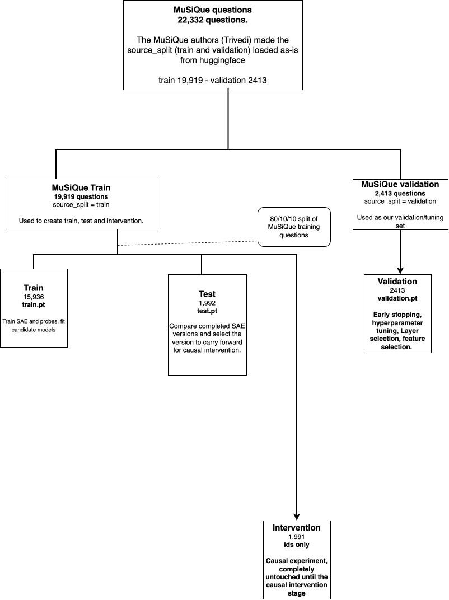

# Activations: what is captured, how it is stored, how rows are indexed

## What one activation is

For every Solver generation the collector installs a forward hook on each requested decoder block (`src/mas_sae/activations/capture.py`, sites from `activations/sites.py`: `model.language_model.layers.N` for Gemma 3). The hook keeps only the **first** call of the block, which is the prompt prefill pass, and stores the hidden state at the **last prompt token**, as float32 on CPU. Because the chat template is applied with `add_generation_prompt=True`, that token is the end of the assistant turn header: the model's state just before it produces its first output token. Nothing from the generated tokens is stored.

So, per question and layer:

- **Attempt 1 activation**: the state before the Solver writes A1, with the question and paragraphs in context.
- **Attempt 2 activation**: the state before the Solver writes A2, with the question, paragraphs, A1 and the Critic's feedback in context. This is the position where "will the Solver take the feedback" is decided but not yet expressed.

Only Solver activations are captured. The hidden size for Gemma-3-4b-it is 2560.

## Files

```
data/activations/<run>/layer_NN/<source_split>_attempt1.pt   # one row per collected question
data/activations/<run>/layer_NN/<source_split>_attempt2.pt   # one row per episode
data/activations/<run>/layer_NN/<source_split>.pt            # attempt1 rows, then attempt2 rows
```

The third file is the SAE-facing tensor; `scripts/train_sae.py` reads it as unlabeled rows (train / validation / test). Every file is written through `ActivationStore` and read back to verify the round trip before the run is marked finished (`collection_artifacts.py`).

While a run is in progress, chunks live under `data/activations/<run>/_progress/<source_split>/chunk_XXXXXXXX/` with their own `records.jsonl` and `activations.pt`; `merge_chunks` concatenates them in order and assigns the global indices below.

## Indices in `interactions.jsonl`

| Field | Row in | Formula |
|---|---|---|
| `attempt1_activation_index` | `<split>_attempt1.pt` | position of the question in collection order |
| `attempt2_activation_index` | `<split>_attempt2.pt` | position of the episode in collection order |
| `sae_attempt1_index` | `<split>.pt` | `attempt1_activation_index` |
| `sae_attempt2_index` | `<split>.pt` | `len(attempt1 rows) + attempt2_activation_index` |

With one condition per question (the production policy) the two collection-order indices are equal, and `production._activation_index` refuses a record where they differ. `collected_question_ids.json` lists question ids in the same order, so row `i` of every per-layer file is the same question.

Alignment is checked twice: by `_validate_alignment` when chunks are merged, and by `load_production_activations` when rows are read, which compares the manifest index with the record's index and the file's row count.

## Partitions and exports

The source split mixes research roles. `results/behavior/<package>/split_manifest.csv` maps each `question_id` to its partition (train / validation / test / intervention) and to `full_index` (its row in `natural_4b_full`) and `scan_index` (its row in the layer scan, when present). The frozen `partitions.csv` is the authority on membership; indices are rebuilt per run. See `behavior_v01.md`, "Keeping evaluation honest" and "Re-running the collection".

`scripts/export_partition_activations.py` writes the same three-file layout under a new run name with the partition in place of the source split, for example `natural_4b_partitioned/layer_33/train_attempt2.pt`, re-indexes the records per partition and records `source_activation_index` so a row can be traced back. Intervention is exported as ids only.



Editable source: `docs/diagrams/data_split_workflow.drawio`. The overall experimental pipeline diagram is `proposal/revised_capstone_diagram.drawio` (`.drawio.svg` beside it), embedded in `proposal/proposal.md`.

## Who reads what

| Consumer | Reads | Uses the indices? |
|---|---|---|
| SAE training (`scripts/train_sae.py`, `sae/dataloader.py`) | `layer_NN/{train,validation,test}.pt` of an exported run | No: unlabeled rows, A1 and A2 together |
| Probes (`production.load_labeled_rows` + `load_production_activations`) | `labels.csv`, the manifest, `layer_NN/<split>_attempt{1,2}.pt` | Yes: manifest index must equal the record index, with purpose gating (`fit`, `tune`, `evaluate`, `intervene`) |
| Layer-selection probe (PR #51) | exported partition runs through the same loader | Yes |
| Causal stage | `intervention_question_ids.json` and the stored episodes; re-runs the Solver live | Indices not needed: the hook runs at generation time |
| Alignment checks (`experiments/alignment.py`, `scripts/validate_pilot_activations.py`) | records and tensors | Yes |

Use `attempt=2` rows for feedback-uptake questions and `attempt=1` rows for the "before feedback" control; never mix a row from `<split>.pt` with an index meant for the per-attempt files.
