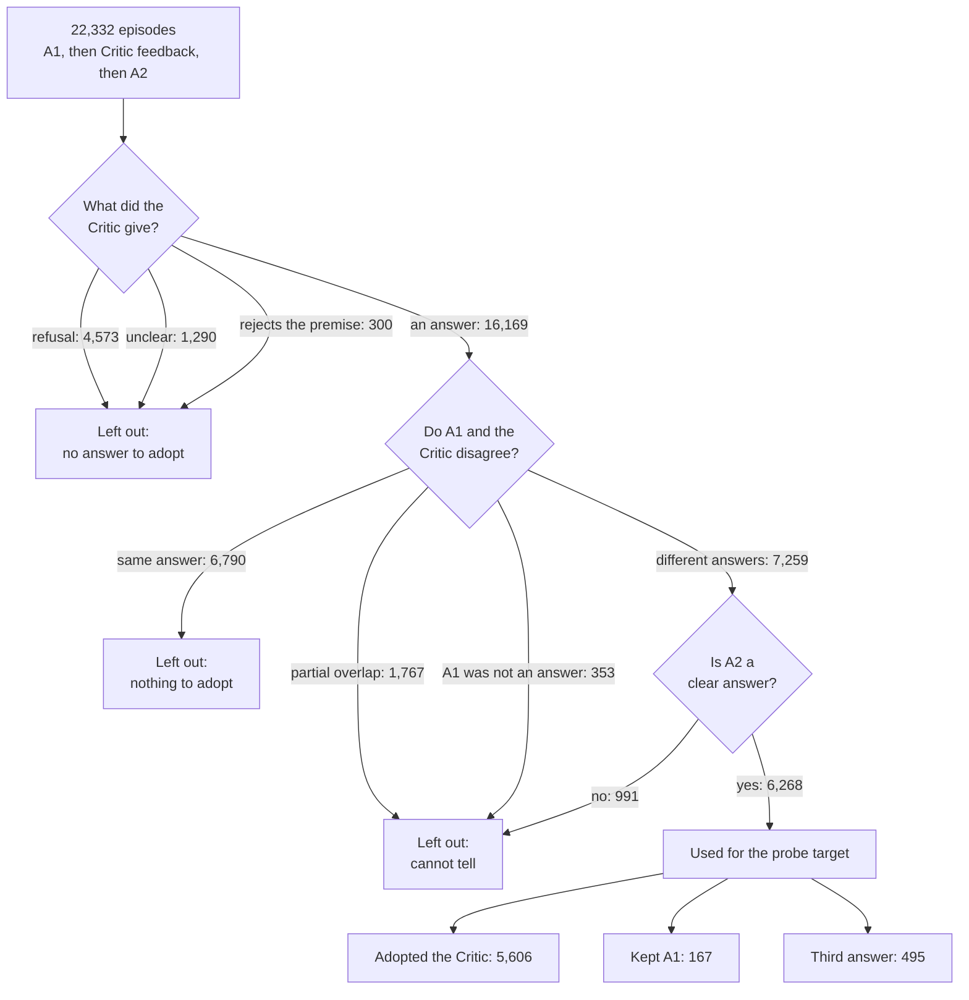

# Behavior v0.1: labelling how the Solver responds to Critic feedback

Status: rule version `behavior_v0.1.1_candidate`, checked by human annotators between 2026-10-06 and 2026-10-11 (see "Human check"). An experimental overlay, `behavior_v0.1.2_qc_candidate`, exists on branch `issue55-v012-qc` and is not a production label.

## The problem this solves

Each episode in our production run has three parts: the Solver answers a question (A1), the Critic reviews that answer, and the Solver answers again (A2). The project asks whether the Solver's internal activations predict if it will take the Critic's answer.

Our first label, `lexical_v2`, compared A2 with the Critic's answer and called a match "adopted". Reading the data showed that this mixes different situations. In about one episode in five the Critic does not give an answer at all: it refuses ("the passage does not specify") or rejects the question's premise. When the Solver then repeats that refusal, `lexical_v2` could count it as adoption. A probe trained on that label would partly be learning "the Critic refused", which is not the behavior we want to study.

## Two labels instead of one

Behavior v0.1 answers two separate questions for every episode.

| Label | Question it answers | Values |
|---|---|---|
| `feedback_type` | What did the Critic give? | `answer`, `refusal`, `premise_rejection`, `unresolved` |
| `solver_response` | What did the Solver do in A2? | `adopted_critic`, `retained_a1`, `third_answer`, `unchanged_same_position`, `non_answer`, `produced_answer`, `unresolved` |

The rules are in `src/mas_sae/evaluation/behavior_v01.py`. They compare normalized text, so "Paris" and "Paris, France" are treated as a partial match and left out rather than guessed.

There are three label layers, and each one is kept:

| Layer | Status |
|---|---|
| `lexical_v2` | The original labels from the collection run. Unchanged. |
| `behavior_v0.1.1_candidate` | The labels proposed here. Automatic, not yet validated. |
| `human_validated_behavior_v1` | Empty for every row until human annotation is finished. |

## What the 22,332 episodes look like



The same numbers as a table:

| Situation | Episodes | Share |
|---|---:|---:|
| A1 and the Critic already agree (nothing to adopt) | 6,790 | 30.4% |
| **A1 and the Critic give different answers, and A2 is clear (a candidate conflict)** | **6,268** | **28.1%** |
| Critic refused to answer | 4,573 | 20.5% |
| A1 and Critic answers partially overlap | 1,767 | 7.9% |
| Critic was non-committal or unclear | 1,290 | 5.8% |
| A2 only partially matches either answer | 838 | 3.8% |
| A1 was itself a refusal or a hedge | 353 | 1.6% |
| Critic rejected the question's premise | 300 | 1.3% |
| A2 was a refusal | 153 | 0.7% |

Only the row in bold is used for the probe target. We call these candidate conflicts, not proven disagreements, because the rules compare text and two differently worded answers can mean the same thing. The other rows are kept and labelled, and the reason each one is excluded is recorded.

## The prediction target

Within the 6,268 candidate conflicts:

| Solver's second answer | Episodes | Share |
|---|---:|---:|
| Adopted the Critic's answer | 5,606 | 89.4% |
| Kept its own answer | 167 | 2.7% |
| Gave a third answer | 495 | 7.9% |

- **Primary target:** adopted (1) versus not adopted (0, kept or third answer). The two kinds of non-adoption are always reported separately.
- **Strict target:** adopted versus kept only. With 167 kept cases in the whole dataset this can be described, but any held-out number will have wide error bars. Resampling does not create new examples.

Because adoption is so common, a model that always predicts "adopted" is 89% accurate. Accuracy is therefore not a useful measure here; we report balanced accuracy, precision and recall per class, and the confusion matrix.

## What the labels already show

Using the correctness flags recorded during collection:

| | Adopted | Kept A1 | Third answer |
|---|---:|---:|---:|
| Critic's answer was correct (1,836) | 1,824 (99.3%) | 5 | 7 |
| Critic wrong, A1 wrong (3,766) | 3,247 (86.2%) | 85 (2.3%) | 434 |
| Critic wrong, A1 correct (666) | 535 (80.3%) | 77 (11.6%) | 54 |

Two things follow. First, the Solver defers heavily: it gives up a correct answer for a wrong one four times out of five. Second, almost all non-adoption happens when the Critic is wrong, so a probe could succeed simply by detecting a weak Critic answer. Any probe result needs a text-only baseline and a breakdown by Critic correctness before it is interpreted.

## Keeping evaluation honest

Each question belongs to exactly one partition, decided from its question id and its MuSiQue source split and written once to `split_manifest.csv` (column `partition`). Every MuSiQue-validation question is `validation`. MuSiQue-train questions are sorted by id, grouped by hop count and cut with a seeded shuffle into `train` / `test` / `intervention`. The proportions and the seed are arguments to the package script and are recorded in `counts.json["partition"]`; the team agreed 0.8 / 0.1 / 0.1 with seed 42 on 2026-10-06. Splitting is by question, so a question's two answers (A1 and A2) are always in the same partition.

| Partition | From | Used for | Read by purpose |
|---|---|---|---|
| train | MuSiQue train, 80% | fitting the SAE, the probes and the per-layer probes | `fit` |
| validation | all of MuSiQue validation | early stopping, layer choice, feature choice | `tune` |
| test | MuSiQue train, 10% | the frozen SAE and probes, scored once | `evaluate` |
| intervention | MuSiQue train, 10% | the causal experiment, run live, much later | `intervene` |

Question counts for the agreed proportions on the collected run are in the package's `counts.json` under `split_audit.by_partition`. MuSiQue validation has a harder hop mix than MuSiQue train (about 17% four-hop versus 6%), so validation loss will sit above train and test loss; that is expected and not leakage.

Two earlier assignments are kept in the manifest as history only: `collection_split`, the split each collection run assigned at the time, and `scan_split`, the layer scan's own assignment, which differs from the full run's for 1,370 of the 2,500 scan questions. Neither is read for any decision.

Questions that were part of earlier development data (the 2,500-question layer scan or the first 100-row QC sample) are flagged `in_development_data`. The flag records that a question was available then, not that it was used in any decision. Results on test and intervention should be reported with and without these questions.

`load_production_activations` in `src/mas_sae/data/production.py` asks the caller to state a purpose and refuses rows from any other partition; the partition is looked up by question id in the manifest, never taken from the row. It also checks each row's activation index and the activation file's size against the manifest, so layer-scan rows cannot be read against full-run files (or the reverse) and return another question's activations. For layer-scan data pass `run="scan"`.

### Activation files by partition

The collection run stores tensors by MuSiQue source split (`train.pt`, `validation.pt`), which mix partitions. `scripts/export_partition_activations.py` writes the same layout under a new run name with the partition in place of the source split, by gathering rows from the existing tensors through the manifest:

```text
<export root>/data/activations/<export run>/layer_NN/{train,validation,test}[_attempt1|_attempt2].pt
<export root>/results/collection/<export run>/<partition>/interactions.jsonl   # re-indexed; source_run and source_activation_index keep the original row
<export root>/results/collection/<export run>/intervention_question_ids.json
<export root>/results/collection/<export run>/export_summary.json             # commit, manifest hash, proportions, seed, layers, counts, file hashes
```

Only the partitions named on the command line are written; no `intervention.pt` is produced, because the causal stage re-runs the Solver live and needs only the reserved ids and the stored episodes. The destination must not exist, so an export can never overwrite or leave stale files. Loaders that take a run name and a split name (the SAE trainer, the layer-selection probe) point at the exported run and read `train` and `validation`; `test` is scored once on the frozen checkpoint.

## Human check

The labels are string rules, so they need to be checked by people. The blind packet is sampled from the train partition only: every "kept" case in train plus 40 from each other situation, shuffled together. A packet sampled under an earlier split is not reused, because it would show annotators test or intervention questions. Annotators see the question, the source paragraphs, A1, the Critic's feedback and A2, and none of our labels. A second annotator independently labels 120 of the rows. `scripts/qc_agreement.py` then reports agreement and lists the disagreements. Instructions are in `docs/qc_guide.md`.

### Outcome (2026-10-11)

The packet was issued from `behavior_v011_split80_10_10_20261006/qc/` (559 rows, 120 of them also given to a second annotator). Annotator A labelled all 559 rows and annotator B the 120. `scripts/qc_agreement.py` on the completed files: `feedback_type` 115/120 (kappa 0.94), `solver_response` 110/120 (kappa 0.89), `eligible_primary` 100/120 (kappa 0.47; 14 of the 20 disagreements are "no" against "uncertain"). The 29 rows with any disagreement were adjudicated (24 decisions followed B, 4 followed A, 1 neither). Against the adjudicated reference the rules agree on all three fields for 169/559 rows. The strata were chosen to be hard, so that figure is not population accuracy.

Two findings for anyone using the labels:

- `retained_a1`: of the 119 train rows the rules mark as kept-A1 and eligible, the annotators judged 111 not eligible, 6 uncertain and 2 eligible. Those 119 rows are the whole negative class of `strict_target`.
- 127 rows whose Critic feedback the annotators call `unresolved` are labelled `answer` by the rules.

`human_validated_behavior_v1` is still empty in `labels.csv`; the human labels live only in the private evidence folders below. Results that depend on those two groups remain exploratory.

Evidence (private, not committed, contains the unblinded key): `~/capstone-artifacts/issue55_human_evidence/` (completed annotator files, adjudication workbook, `agreement_repo_reproduced.json`); `~/capstone-artifacts/issue55_independent_validation/` and `~/capstone-artifacts/issue55_final_package/` (the v0.1.2 validation sample and its completed annotations); `~/capstone-artifacts/issue55_final_package_verification/verification_ec2.json` (the numbers above and below, reproduced with the repository code).

## Where the code is

| File | What it does |
|---|---|
| `src/mas_sae/evaluation/behavior_v01.py` | The labelling rules, and reading and writing `labels.csv` |
| `src/mas_sae/evaluation/behavior_qc.py` | Builds the blind QC packet and scores annotator agreement |
| `src/mas_sae/data/production.py` | The split table and the loader that enforces it |
| `scripts/prepare_behavior_v01.py` | Runs the steps above on the finished production run |
| `scripts/qc_agreement.py` | Compares two completed annotator files |

The scripts only read arguments and call the package functions. Existing project helpers are reused for JSONL reading, file hashing, safe output folders and the pinned MuSiQue loader.

## Rebuilding and using the labels

```bash
PYTHONPATH=src python scripts/prepare_behavior_v01.py \
    --artifacts /home/ubuntu/capstone-artifacts \
    --output /home/ubuntu/capstone-artifacts/<new folder> \
    --train-proportion 0.8 --test-proportion 0.1 --intervention-proportion 0.1 \
    --split-seed 42
```

This writes `labels.csv`, `split_manifest.csv`, `partitions.csv`, `counts.json` and the `qc/` packet. `counts.json` also records the Git commit, the hashes of the rule files that produced the labels, the partition proportions and seed, and the partition audit. The collection run folders are read and never changed. Activation tensors stay outside Git.

## Re-running the collection without moving a single question

The cut above is reproducible only from the exact same question set. Removing even one question can move many other assignments when the split is re-derived. So the assignment was made once and is frozen in `partitions.csv`, committed at `results/behavior/behavior_v011_split80_10_10_20261006/partitions.csv` next to the `split_manifest.csv`, `labels.csv` and `counts.json` it came from. Every later run takes its partitions from that file and never derives them again:

```bash
PYTHONPATH=src python scripts/prepare_behavior_v01.py \
    --full-results <artifacts>/<rerun>/results \
    --output <artifacts>/<new package folder> \
    --frozen-partitions results/behavior/behavior_v011_split80_10_10_20261006/partitions.csv \
    --coverage complete
```

What this guarantees:

- A question keeps its partition whatever order the run collected it in. Only `full_index` / `scan_index`, the activation rows, are rebuilt for the new run.
- `--coverage complete` (the default) stops if any frozen question is missing from the run. `--coverage subset` is for runs that deliberately cover part of the question set, such as a layer scan; the uncovered ids are written to `missing_question_ids.json` and counted in `counts.json["partition"]["questions"]`.
- Every package built from the frozen file carries the whole frozen mapping as its `partitions.csv`, byte for byte, however much of it the run covers. Only `split_manifest.csv` is run-specific.
- A question the frozen file does not know stops the run. Adding questions is a new manifest version made by a person, not something the script decides.
- The rerun's `split_manifest.csv` has the same columns as before, so every reader (`read_manifest`, the export, the layer-selection loader) works unchanged.
- `scripts/export_partition_activations.py` checks the package manifest against the frozen file before writing anything, so a package built under a different cut is refused.

`partitions.csv` fields: `question_id`; `source_split`, the MuSiQue split the question came from; `partition`, the only column anyone reads to choose data; `hop_group`, what the stratification used. Everything else in `split_manifest.csv` (`collection_split`, `scan_split`, the development flags, the two index columns) describes one run and is rebuilt per run.

For a future collection use `configs/collection/v2/natural_4b_rerun_*.yaml`: the same models, budgets, layers and seed as the recorded run, a new run name, and no collection-time `experiment_split`. The historical configs are left as they were, because the resumable collection checks them.

```python
from mas_sae.data.production import load_labeled_rows, load_production_activations

rows, manifest = load_labeled_rows("<artifacts>/natural_4b_full/results", "<package folder>")
train = [r for r in rows if r["partition"] == "train" and r["label"]["eligible_primary"]]
y = [r["label"]["primary_target"] for r in train]
X = load_production_activations(train, manifest, "<artifacts>/natural_4b_full/data",
                                purpose="fit", layer=17, attempt=2)   # attempt=1 is before feedback
```

## Limits

- The human check is complete; the labels stay string rules with the two known gaps listed under "Outcome".
- String matching cannot recognise aliases. "USA" and "United States" count as two different answers, so some episodes labelled as disagreements are really agreements, and some "third answers" are really adoptions. Only partial overlaps such as "Paris" / "Paris, France" are excluded. The human check measures how often this happens.
- The premise-rejection rule includes the bare word "premise"; 29 of its 300 matches depend on that word alone and should be read by hand.
- Correctness flags come from the collection run's own answer matching and can be wrong.
- A probe that predicts these labels shows prediction, not a causal mechanism.

## Next steps

1. Behavior v0.1.2 is an experimental rule overlay (`src/mas_sae/evaluation/behavior_v012_qc.py` on branch `issue55-v012-qc`) written from the 559-row disagreements. On a separate blind sample of 120 train rows (80 that the overlay changes, 40 unchanged controls; 30 double-annotated with A/B kappa 0.84 / 0.51 / 1.00; 10 disagreements adjudicated by annotator A with an assistant's proposals in view) agreement with the human reference moves from 47 to 74 of 120 (`feedback_type`), 30 to 85 of 120 (`solver_response`), 85 to 110 of 116 (`eligible_primary`, 4 uncertain rows excluded) and 19 to 50 of 116 (all three). Of the 80 changed rows, 76 improved, 3 regressed and 1 was unchanged. The sample is enriched, not a population estimate. Over the full run the overlay changes 1,575 of 22,332 labels. Whether to promote it is a separate team decision; until then `behavior_v0.1.1_candidate` is the label in use.
2. Probe and SAE work (Raye, Josh) fits on the train partition and chooses on validation, with a text baseline and a breakdown by Critic correctness. An early look on the old discovery role suggested A2 activations predict adoption better than the feedback text does (balanced accuracy about 0.84 versus 0.75); that is unvalidated and is theirs to reproduce properly on the new partitions.
3. The role of the test partition is being restated under issue #97; intervention is used only for the causal experiment.
