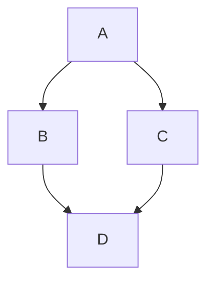

## Date: Week 1 - 08 25 2026

- Topics of discussion
  - Proposal
  - Item2
  - Item3

- Action Items:

* [ ] Lit review
* [ ] Github
* [ ] Experiment diagram
* [ ] Action Item 4
* [ ] Action Item 5

---

## Date: Week 2 - 09 01 2026

- Topics of discussion
  - Proposal
  - Better diagram
  - Item3

- Action Items:

* [ ] Action Item 1
* [ ] Action Item 2
* [ ] Action Item 3
* [ ] Action Item 4
* [ ] Action Item 5

---

## Date: Week 3 - 09 08 2026

- Topics of discussion
  - Showing finalized proposal
  - Get initial pipeline set up
  - Item3

- Action Items:

* [ ] Action Item 1
* [ ] Action Item 2
* [ ] Action Item 3
* [ ] Action Item 4
* [ ] Action Item 5

---

## Date: Week 4 - 09 15 2026

- Topics of discussion
  - Showing initial pipeline
  - Need better results formatting
  - Try to get initial results

- Action Items:

* [ ] Set up organized structure that is understandable for interpreting results
* [ ] Make sure the pipeline is entirely in sync
* [ ] Start fixing the review comments left by professor

---

## Date: Week 5 - 09 22 2026

- Topics of discussion
  - Item1
  - Item2
  - Item3

- Action Items:

* [ ] Action Item 1
* [ ] Action Item 2
* [ ] Action Item 3
* [ ] Action Item 4
* [ ] Action Item 5

---

## Date: Week 6 - Month Day Year

- Topics of discussion
  - Item1
  - Item2
  - Item3

- Action Items:

* [ ] Action Item 1
* [ ] Action Item 2
* [ ] Action Item 3
* [ ] Action Item 4
* [ ] Action Item 5

---

## Date: Week 7 - Month Day Year

- Topics of discussion
  - Item1
  - Item2
  - Item3

- Action Items:

* [ ] Action Item 1
* [ ] Action Item 2
* [ ] Action Item 3
* [ ] Action Item 4
* [ ] Action Item 5

---

## Date: Week 8 - Month Day Year

- Topics of discussion
  - Item1
  - Item2
  - Item3

- Action Items:

* [ ] Action Item 1
* [ ] Action Item 2
* [ ] Action Item 3
* [ ] Action Item 4
* [ ] Action Item 5

---

## Date: Week 9 - Month Day Year

- Topics of discussion
  - Item1
  - Item2
  - Item3

- Action Items:

* [ ] Action Item 1
* [ ] Action Item 2
* [ ] Action Item 3
* [ ] Action Item 4
* [ ] Action Item 5

---

## Date: Week 10 - Month Day Year

- Topics of discussion
  - Item1
  - Item2
  - Item3

- Action Items:

* [ ] Action Item 1
* [ ] Action Item 2
* [ ] Action Item 3
* [ ] Action Item 4
* [ ] Action Item 5

---

## Date: Week 11 - Month Day Year

- Topics of discussion
  - Item1
  - Item2
  - Item3

- Action Items:

* [ ] Action Item 1
* [ ] Action Item 2
* [ ] Action Item 3
* [ ] Action Item 4
* [ ] Action Item 5

---

## Date: Week 12 - Month Day Year

- Topics of discussion
  - Item1
  - Item2
  - Item3

- Action Items:

* [ ] Action Item 1
* [ ] Action Item 2
* [ ] Action Item 3
* [ ] Action Item 4
* [ ] Action Item 5

---

## Date: Week 13 - Month Day Year

- Topics of discussion
  - Item1
  - Item2
  - Item3

- Action Items:

* [ ] Action Item 1
* [ ] Action Item 2
* [ ] Action Item 3
* [ ] Action Item 4
* [ ] Action Item 5

---

## Date: Week 14 - Month Day Year

- Topics of discussion
  - Item1
  - Item2
  - Item3

- Action Items:

* [ ] Action Item 1
* [ ] Action Item 2
* [ ] Action Item 3
* [ ] Action Item 4
* [ ] Action Item 5

---

- **_Add Images and Diagrams Using Excalidraw_**
  - Just draw it and then copy as png paster in the editor
    

- **_Add Equation_**
  - $e^{\pi i} + 1 = 0$

- **_Add Pyhton Code_**

```
import numpy as np
a = np.array()
```

- **_Add Tables as needed._**

| Checkbox Experiments | checked header | crossed header |
| -------------------- | :------------: | :------------: |
| checkbox             |  &check; Row   |  &cross; row   |

- **_Add Tables as needed._**

| checked  | unchecked | crossed  |
| -------- | --------- | -------- |
| &check;  | \_        | &cross;  |
| &#x2611; | &#x2610;  | &#x2612; |

- **_Add Tables as needed._**

| Selection |     |
| --------- | --- |
| &#x2610;  |

| Selection |     |
| --------- | --- |
| &#x2611;  |

- **_Create Links as needed_**
  - [link text](full url minus the en-us locale)

- **_Add Geo Json_**

```geojson
{
  "type": "FeatureCollection",
  "features": [
    {
      "type": "Feature",
      "id": 1,
      "properties": {
        "ID": 0
      },
      "geometry": {
        "type": "Polygon",
        "coordinates": [
          [
            [
              -90,
              35
            ],
            [
              -90,
              30
            ],
            [
              -85,
              30
            ],
            [
              -85,
              35
            ],
            [
              -90,
              35
            ]
          ]
        ]
      }
    }
  ]
}
```

- **_Add flow chart_**


